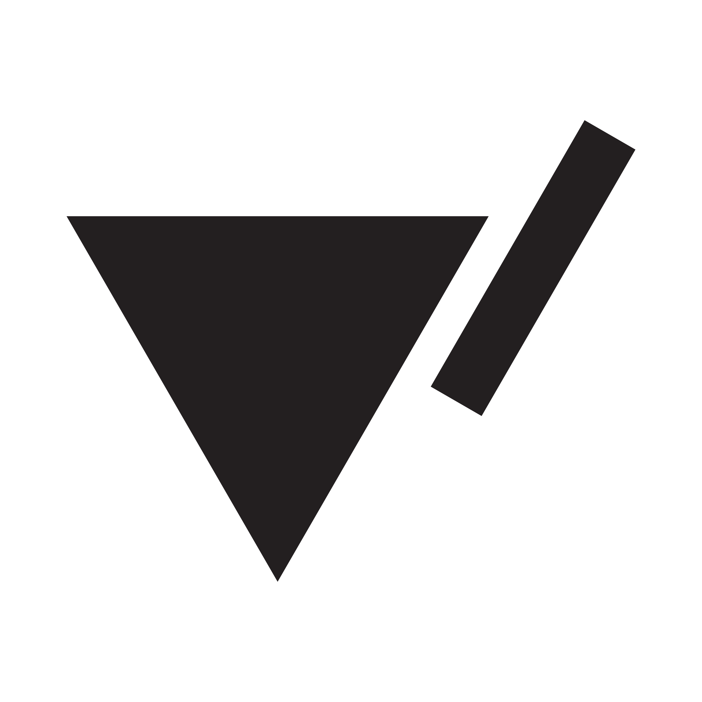

# My Portfolio – Built with Next.js 15

Welcome to my personal portfolio! This project showcases my work, skills, and journey as a developer and designer. The site is built with the latest Next.js 15, fully optimized for performance, SEO, and user experience.

## Features

- **Modern Tech Stack:** Powered by Next.js 15, deployed seamlessly on Vercel.
- **Custom Design & Animations:** Every pixel and animation is crafted by me, reflecting my design philosophy and attention to detail.
- **SEO Optimization:** Structured for maximum visibility and discoverability on search engines.
- **Email Subscription:** Stay updated! Integrated email subscription for visitors.
- **Responsive & Accessible:** Looks great on all devices and accessible to everyone.
- **Social Integrations:** Connect with me on Instagram, LinkedIn, Twitter, and GitHub.

## ech Stack

- [Next.js 15](https://nextjs.org/)
- [Vercel](https://vercel.com/)
- [TypeScript](https://www.typescriptlang.org/)
- [Geist Font](https://vercel.com/font)
- [Motion.Dev](https://motion.dev/)
- [Tailwind CSS](https://motion.dev/)
- [Email Subscription Service] (e.g., Resend, etc.)

## 📬 Connect with Me

- [Instagram](https://instagram.com/yovizn)
- [LinkedIn](https://linkedin.com/in/yovi-zulkarnaen-793707229)
- [Twitter](https://x.com/yovizn_)
- [GitHub](https://github.com/yovizn)

## 🧑‍💻 About Me

I am the creator, designer, and developer behind this portfolio. From the web structure, design, and animations to SEO optimization and email subscription integration—every aspect is crafted by me.

---

Thank you for visiting my portfolio! Feel free to reach out or connect via any of the social links above.
